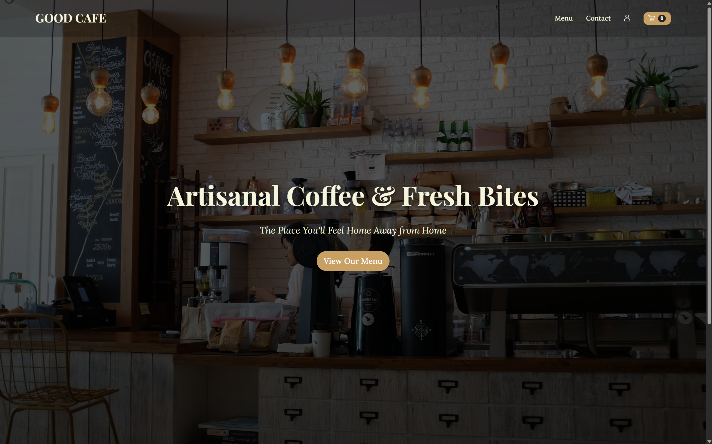
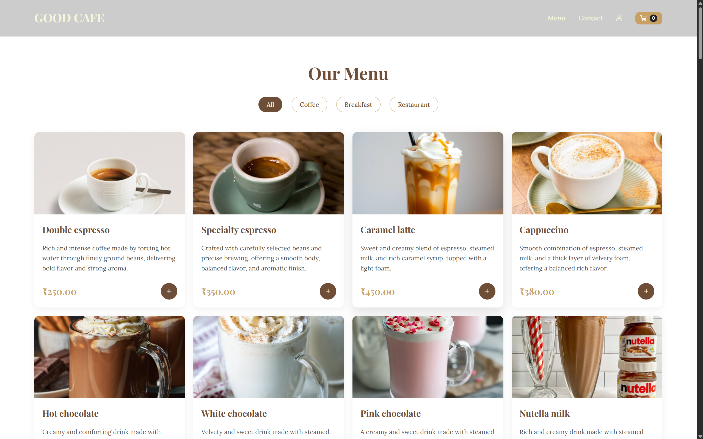
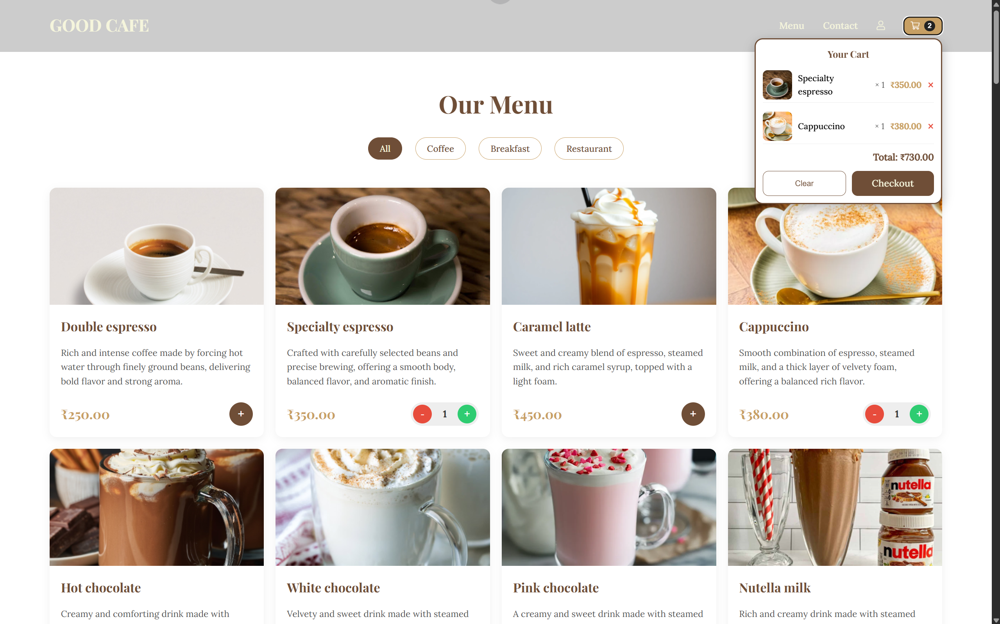
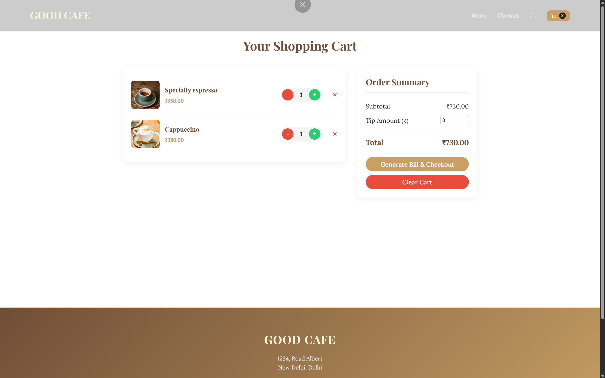
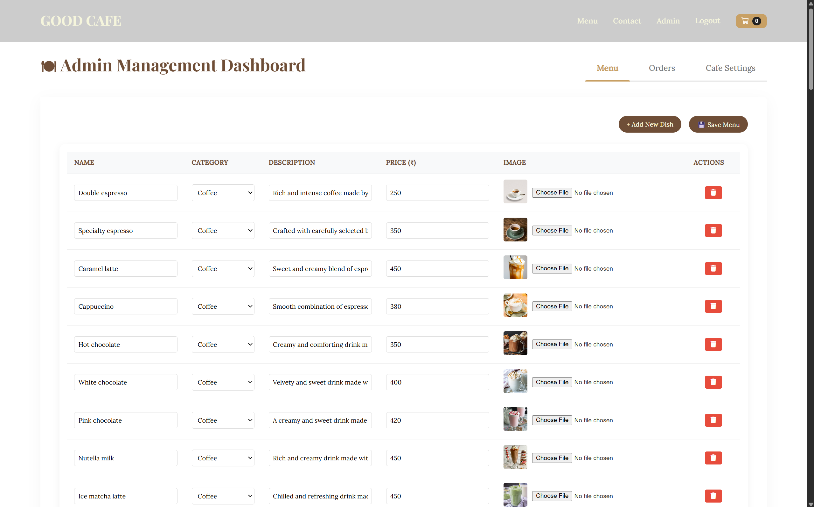
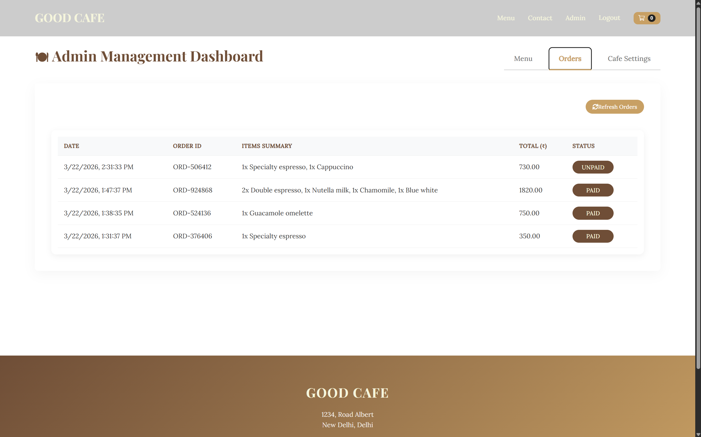
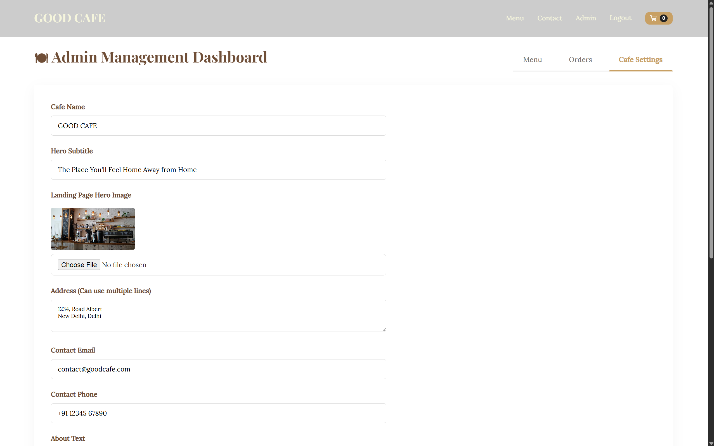
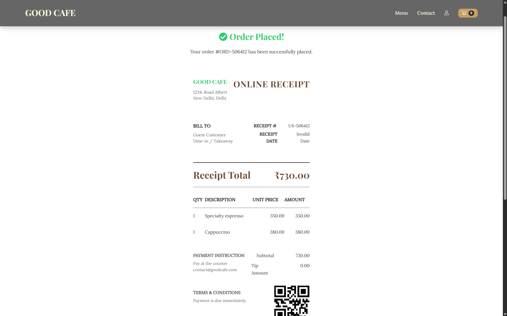

# Digital Restaurant Management System
<div align="center">
  


</div>

---

## Executive Overview

This RMS is a comprehensive, full-stack web application engineered for cafes, restaurants, and food service establishments. The platform delivers a seamless digital menu experience for end-users while providing business operators with advanced administrative capabilities for real-time inventory management, order processing, and dynamic storefront customization.

The application is architected using modern web technologies with an emphasis on security, scalability, and user experience. It supports JWT-based authentication for administrative access, secure image uploads via Multer, and real-time data synchronization through a RESTful API.

---

## Application Screenshots and Demo

<table>
  <tr>
    <td align="center" width="50%">
      <h3>Landing Page</h3>
      
    </td>
    <td align="center" width="50%">
      <h3>Menu Interface</h3>
      
    </td>
  </tr>
  <tr>
    <td align="center" width="50%">
      <h3>Shopping Cart</h3>
      
    </td>
    <td align="center" width="50%">
      <h3>Checkout Experience</h3>
      
    </td>
  </tr>
  <tr>
    <td align="center" width="50%">
      <h3>Admin Dashboard - Menu Management</h3>
      
    </td>
    <td align="center" width="50%">
      <h3>Admin Dashboard - Order Tracking</h3>
      
    </td>
  </tr>
  <tr>
    <td align="center" width="50%">
      <h3>Admin Dashboard - Settings</h3>
      
    </td>
    <td align="center" width="50%">
      <h3>Receipt and Invoice</h3>
      
    </td>
  </tr>
</table>


## Core Features

### Customer-Facing Features

#### Interactive Digital Menu

The customer interface presents a browsable menu organized by category (Coffee, Breakfast, Restaurant items) with smooth scroll-reveal animations and responsive design patterns. The menu system provides full accessibility compliance and adapts dynamically to multiple screen sizes without degrading performance.

#### Dynamic Shopping Cart System

Customers can add items to a persistent cart, modify quantities in real-time, configure optional tips, and instantly view the cumulative total cost. All cart operations are performed without page reloads, utilizing React's Context API for efficient state management and preventing unnecessary re-renders through memoization.

#### Responsive User Interface

The frontend employs CSS3 custom properties (variables) for consistent theming and rapid design iterations. The design system ensures accessibility compliance (WCAG 2.1 AA standards) and utilizes semantic HTML5 elements for improved screen reader compatibility.

### Administrator Dashboard Features (JWT-Secured)

#### Menu Item Management

Administrators can modify menu item properties including prices, display names, item descriptions, and operational status (active/inactive). Changes propagate in real-time across all customer-facing instances without requiring server restarts.

#### Order Management and Tracking

The system provides real-time order visibility with chronological sorting by transaction date. Operators can toggle individual orders between "Paid" and "Unpaid" status, facilitating accurate revenue reconciliation and payment processing workflows.

#### Storefront Configuration Interface

The admin dashboard enables dynamic modification of establishment-level settings including:
- Café or restaurant legal name
- Physical address and location details
- Contact telephone and email information
- Business description and operational hours
- Integrated social media links (Facebook, Instagram, Twitter)

#### Custom Hero Image Management

Administrators can upload custom landing page background imagery directly through the dashboard interface. The uploaded image supersedes default assets, enabling seasonal promotions and brand customization without requiring code deployment.

#### Printable Receipt Generation

The system includes a print-optimized CSS layout stylesheet that generates professional invoices and receipts suitable for thermal printers, POS systems, or email distribution. The layout includes itemized lists, subtotals, tax calculations, and payment method tracking.

---

## Technical Architecture

### Frontend Architecture

#### React and Vite

The frontend is implemented using React 18+ with Vite as the build tool, providing optimized Hot Module Replacement (HMR) and production bundling. Vite enables significantly faster build times compared to traditional bundlers like Webpack, with modern ES module support throughout the development workflow.

#### State Management

React Context API is utilized for global state management, eliminating the need for external libraries like Redux while maintaining predictable data flow. The architecture includes separate contexts for:
- Authentication state and JWT token persistence
- Shopping cart operations and quantity management
- Application settings and theme configuration

Memoization techniques (useMemo, useCallback) prevent unnecessary re-renders of child components when parent context values are updated.

#### Routing

React Router (v6+) handles client-side navigation with lazy loading of route components to minimize initial bundle size. Protected routes enforce authentication requirements for administrative interfaces.

#### Styling Methodology

CSS3 custom properties enable consistent theming across the application with minimal code duplication. The system uses BEM (Block Element Modifier) naming conventions for maintainable class hierarchies and avoids CSS-in-JS solutions to keep the bundle lightweight.

### Backend Architecture

#### Express.js Framework

The backend is built on Express.js, a lightweight and unopinionated Node.js web framework that provides HTTP server functionality, middleware composition, and routing capabilities. The framework handles:
- RESTful API endpoint definition and request routing
- Middleware for authentication, CORS, and request parsing
- Static file serving and upload handling

#### Authentication and Authorization

JWT (JSON Web Token) authentication secures the administrative dashboard. Upon login with valid credentials, the server generates a time-limited JWT token that clients must include in subsequent requests via Authorization headers. The token is verified server-side before granting access to protected endpoints.

#### File Upload Processing

Multer middleware manages file uploads from the dashboard, providing:
- Stream-based file handling for memory efficiency
- File size validation and type checking
- Automatic file naming and directory management
- Integration with the file system for persistent storage

Uploaded images are stored in `client/public/assets/uploads/`, making them accessible via HTTP requests without additional processing.

#### Request Validation

The API validates incoming request bodies to ensure data integrity and prevent injection attacks. Validation includes type checking, required field verification, and range validation for numeric inputs.

### Database Architecture

#### MongoDB and Mongoose

MongoDB is selected as the primary data store, providing flexible document-based storage with horizontal scalability. The schema is defined using Mongoose ODM, which provides:
- Type-safe field definitions and validation
- Automatic CRUD operation generation
- Relationship management through references and population
- Middleware hooks for pre/post-operation logic

#### Data Models

The application uses four primary collections:

**Menu Items Collection:** Stores product information including name, description, price, category classification, and availability status. This collection supports full-text search and filtering by category.

**Orders Collection:** Records customer transactions with timestamps, item lists, quantities, calculated totals, and payment status. Orders are indexed by date for efficient range queries and reporting.

**Cafe Settings Collection:** Maintains single-document configuration including establishment name, address, contact information, business description, and social media URLs. This singleton pattern ensures consistency and simplifies updates.

**Admin Users Collection:** Stores administrator credentials with encrypted password hashes and role-based access control flags. Production deployments must utilize strong password hashing algorithms (bcrypt with salt rounds >= 10).

---

## Project Structure and Organization

```
e-menu/
├── client/                          # React frontend application
│   ├── public/
│   │   └── assets/
│   │       ├── uploads/             # Dynamically uploaded images (git-ignored)
│   │       └── [other assets]       # Logo and default imagery
│   ├── src/
│   │   ├── components/              # Reusable UI components
│   │   │   ├── Navbar.jsx           # Header navigation
│   │   │   ├── Footer.jsx           # Footer section
│   │   │   ├── Cart.jsx             # Shopping cart UI
│   │   │   └── [other components]
│   │   ├── context/                 # React Context providers
│   │   │   ├── AuthContext.jsx      # Authentication state
│   │   │   ├── CartContext.jsx      # Shopping cart state
│   │   │   └── SettingsContext.jsx  # Application settings
│   │   ├── pages/                   # Page-level components
│   │   │   ├── Landing.jsx          # Homepage
│   │   │   ├── Menu.jsx             # Menu browsing
│   │   │   ├── Checkout.jsx         # Payment processing
│   │   │   ├── AdminLogin.jsx       # Administrator authentication
│   │   │   ├── AdminDashboard.jsx   # Admin interface
│   │   │   └── [other pages]
│   │   ├── styles/                  # Global and modular CSS
│   │   │   ├── App.css              # Application styles
│   │   │   ├── variables.css        # CSS custom properties
│   │   │   └── [component styles]
│   │   └── App.jsx                  # Application entry point and routing
│   └── package.json                 # Frontend dependencies and scripts
│
├── server/                          # Node.js/Express backend
│   ├── middleware/                  # Express middleware functions
│   │   └── auth.js                  # JWT verification middleware
│   ├── models/                      # Mongoose schema definitions
│   │   ├── Menu.js                  # Menu items schema
│   │   ├── Order.js                 # Orders schema
│   │   ├── Settings.js              # Café settings schema
│   │   └── Admin.js                 # Admin users schema
│   ├── routes/                      # API endpoint definitions
│   │   ├── menuRoutes.js            # Menu item endpoints
│   │   ├── orderRoutes.js           # Order processing endpoints
│   │   ├── settingsRoutes.js        # Café settings endpoints
│   │   └── authRoutes.js            # Authentication endpoints
│   ├── uploads/                     # Temporary file storage (git-ignored)
│   ├── server.js                    # Express server initialization
│   ├── .env                         # Environment variables (git-ignored)
│   └── package.json                 # Backend dependencies and scripts
│
├── .gitignore                       # Git ignore patterns (uploads, env files)
├── package.json                     # Root project configuration
├── .env.example                     # Environment variables template
└── README.md                        # This documentation
```

---

## Installation and Configuration

### System Requirements

- Node.js version 18 or higher (LTS recommended)
- MongoDB instance (local installation or MongoDB Atlas cloud service)
- npm version 8 or higher

### Step 1: Repository Setup

Clone the remote repository and navigate to the project root:

```bash
git clone https://github.com/your-username/e-menu.git
cd e-menu
```

### Step 2: Dependency Installation

Install dependencies sequentially, beginning with the root project and proceeding through each subdirectory:

```bash
# Install root-level dependencies (Concurrently for parallel execution)
npm install

# Navigate to frontend and install client dependencies
cd client
npm install
cd ..

# Navigate to backend and install server dependencies
cd server
npm install
cd ..
```

### Step 3: Environment Configuration

Create a `.env` file in the `server/` directory with the following variables:

```env
# Server Configuration
PORT=5000

# MongoDB Connection String
# Local: mongodb://localhost:27017/emenu
# MongoDB Atlas: mongodb+srv://<username>:<password>@<cluster>.mongodb.net/<database>
MONGODB_URI=mongodb+srv://<user>:<password>@cluster0.example.mongodb.net/?retryWrites=true&w=majority

# JWT Secret (Use a strong, randomly-generated string in production)
JWT_SECRET=your_super_secret_jwt_key_minimum_32_characters

# Optional: Admin Email (for initial setup)
ADMIN_EMAIL=admin@cafe.com
```

For local MongoDB development, ensure the MongoDB service is running:

```bash
# macOS with Homebrew
brew services start mongodb-community

# Linux with systemd
sudo systemctl start mongod

# Windows
# Start MongoDB service or run: mongod
```

### Step 4: Application Launch

From the project root directory, execute the development server command:

```bash
npm run dev
```

The system will initiate both services simultaneously via Concurrently:
- React development server: `http://localhost:5173`
- Express API server: `http://localhost:5000`

The development server enables Hot Module Replacement (HMR) for the frontend, automatically refreshing the browser upon file modifications.

---

## Default Administrator Access

### Initial Login Credentials

Upon first deployment, access the admin dashboard using seeded credentials:

- **URL:** `http://localhost:5173/admin/login`
- **Email:** `admin@cafe.com`
- **Password:** `AdminUser123!`

### Security Notice

**CRITICAL:** Change the default administrator password immediately after initial login. Production deployments must use strong passwords meeting the following criteria:
- Minimum 12 characters
- Mixture of uppercase and lowercase letters
- Inclusion of numeric digits
- Special character inclusion

Implement password hashing using bcrypt with a salt round count of 10 or higher to prevent unauthorized access.

---


## Troubleshooting

### Common Issues

**MongoDB Connection Failure**
- Verify MongoDB service is running
- Check connection string in `.env` file
- Ensure IP whitelist includes your machine in MongoDB Atlas

**Admin Dashboard Not Loading**
- Verify JWT token is stored in localStorage
- Check browser console for authentication errors
- Ensure API server is running on port 5000

**Image Upload Failing**
- Verify `client/public/assets/uploads/` directory exists and is writable
- Check file size doesn't exceed configured limit (default 5MB)
- Ensure supported image formats (JPG, PNG, WebP)

**Cart State Not Persisting**
- Clear browser localStorage and try again
- Verify React Context provider wraps entire application
- Check for console errors related to state management

---

## License and Contributing

This project is provided as-is for commercial and non-commercial use. Contributions are welcomed via pull requests with adherence to existing code standards and style guidelines.

For contributions:
1. Fork the repository
2. Create feature branch (`git checkout -b feature/AmazingFeature`)
3. Commit changes (`git commit -m 'Add AmazingFeature'`)
4. Push to branch (`git push origin feature/AmazingFeature`)
5. Open Pull Request with detailed description

---

**Developed with modern web engineering practices. Designed for customization and operational excellence.**

*Last Updated: March 2026*
